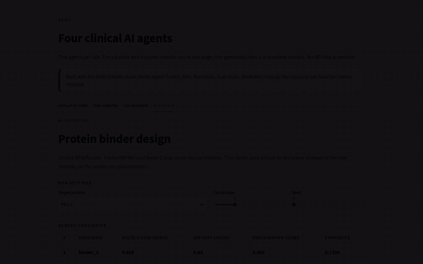
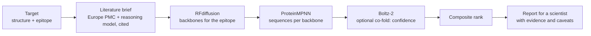

# ai-scientist

## What this project demonstrates

Demonstrates BioNeMo pipeline orchestration, binder-chain selection and heuristic candidate ranking. Simulator structures and scores have no biological meaning.

## Watch the demo



[Portfolio videos](https://anhduongvo.github.io/projects/clinical-agentic-ai/). Clinical recordings use the separate simplified interactive demo.

## Try it offline

Python 3.11–3.13. In a fresh virtual environment, from this repository:

```bash
python -m venv .venv
source .venv/bin/activate
python -m pip install -e ".[dev]"
sci demo
pytest -q
```

## Run with NVIDIA or another configured backend

For real inputs use `sci design target.json`, not the placeholder demo target. Install `.[bio,nat]` as needed. Configure `NGC_API_KEY` or `NVIDIA_API_KEY`, `BIONEMO_BASE_URL`, and reasoning-model settings. Real target structure, sequence, contigs and hotspots are prerequisites. Hosted/self-hosted calls are not runtime-validated here.

Model IDs in `.env.example` and NAT configs are examples, not a current availability guarantee. Check your endpoint before running; the validation below does not include live model execution.

## What is verified

Stable offline seeds, request payloads, explicit binder-only chain design and sequence-length mapping. Ranking is unvalidated; co-fold confidence is not measured binding. The optional NAT integration test needs `pip install -e ".[nat]"`.

| Validation layer | Status |
|---|---|
| Unit/regression tests | Executed locally on Python 3.12; see `docs/validation.md` |
| Mocked/simulated integrations | Executed locally; scope documented in tests |
| Live hosted endpoints | Not executed; access and appropriate inputs required |
| Self-hosted GPU endpoints | Not executed |
| Domain-specific validation | Not completed; synthetic examples only |

See [validation details](docs/validation.md). The architecture and detailed workflows follow.

## Architecture and detailed workflows

**An agent that proposes candidate protein binders for a target and hands a scientist a ranked, cited report.**
It reads the literature, designs backbones, generates sequences, folds and scores the binder-target complex,
and ranks the results, orchestrating NVIDIA BioNeMo biology models the way the Protein Binder Design blueprint
does.

It runs end to end with a **built-in simulator** (no GPU, no key, no network), so the orchestration, ranking
and report are fully testable offline. Point it at the **real BioNeMo NIMs** (hosted or self-hosted) with one
flag when you have access.



## Demo


The interactive demo running on the simulator: changing the target, the seed and the number of candidates updates the ranking. The scores are placeholders. The video is on [anhduongvo.github.io](https://anhduongvo.github.io/projects/clinical-agentic-ai/).

## Why this design

- **Four chained steps.** The agent chains four steps (literature, backbones, sequences,
  folding) and turns their outputs into one ranked, traceable report.
- **Simulator by default.** `SimulatedBioNeMo` returns deterministic, well-formed outputs for every step, so
  the whole pipeline, the ranking logic and the report are covered by offline tests and a key-free demo.
- **Real backend behind one flag.** `--real-bio` switches to the live NIM client, which handles the async
  `202` / `nvcf-reqid` polling that the hosted biology NIMs use for long jobs, and works against a self-hosted
  NIM through `BIONEMO_BASE_URL`.
- **Scoring.** The composite score is a simple, documented heuristic for ranking a screen; it is stated in the
  report, and every candidate is a hypothesis for wet-lab testing.
- **Cited reasoning.** The literature brief may only cite abstracts that were actually retrieved;
  hallucinated citation ids are dropped.

## Quick start

No GPU, key or network needed. Python 3.11 to 3.13.

```bash
python -m venv .venv && source .venv/bin/activate
pip install -e ".[dev]"
sci demo                        # full pipeline with the simulator; literature step stubbed offline
pytest                          # deterministic offline tests
```

`sci demo` writes `runs/demo/report.md` and `report.json`: the literature brief, the method, and the ranked
top candidates with their confidence and scores.

## Using the real models

The simulator is the default. Each real part is opt-in, so you can turn them on one at a time.

```bash
cp .env.example .env            # set NVIDIA_API_KEY for the reasoning model

sci search-lit "PD-L1 binder design"      # real Europe PMC search (network only, no key)
sci demo --real-lit                        # real literature brief, simulated BioNeMo
sci design target.json --real-bio           # requires a real target structure and configured endpoints
sci design my_target.json --real-bio --real-lit --backbones 8 --seqs 8   # your own target, fully live
```

**Reasoning model:** `NVIDIA_API_KEY` and an OpenAI-compatible endpoint (`NIM_BASE_URL`, hosted by default).
`sci models` lists the model IDs your endpoint serves.

**BioNeMo backend for `--real-bio`**, either option:
- Hosted: a key from build.nvidia.com (`NGC_API_KEY`, or `NVIDIA_API_KEY` if that is unset). The client polls
  the hosted biology NIMs' async job endpoint.
- Self-hosted: run the NIM containers and set `BIONEMO_BASE_URL` (Boltz-2, RFdiffusion and ProteinMPNN each run
  on their own port; the full pipeline needs a gateway exposing all configured model paths).

> The real backend has not been exercised against live endpoints in this repository. The client follows the
> documented request and polling format; expect to adjust model paths or request fields on first contact, which
> is why the simulated path is the default and the tested one.

## Target files

A target is a `Target` (see `schemas.py`): `name`, `pdb` (the target structure as a PDB string), `contigs`
(the RFdiffusion contig string, e.g. `"A1-100/0 50-100"` = keep target residues A1-100, chain break, design a
50-100 residue binder), `hotspot_res` (e.g. `["A50","A51"]`), and optionally `target_sequence`. When the target
sequence is set, Boltz-2 co-folds the binder with the target, so the confidence reflects the complex rather than
the binder alone. The bundled demo target uses a placeholder structure so it runs offline.

## Scoring

```
composite = 0.5 * complex_confidence + 0.3 * affinity_probability + 0.2 * (inverse MPNN score)
```

When no ligand affinity is available, the weights fall back to `0.7 * confidence + 0.3 * inverse MPNN score`.
This is a transparent ranking heuristic, not a validated scoring function; the report states this and lists the
caveats, including that binder-only folding (no target sequence) does not measure binding.

## NeMo Agent Toolkit

The pipeline is registered as a NeMo Agent Toolkit component, so it can be run, profiled and served:

```bash
pip install -e ".[nat]"
nat run --config_file configs/workflow.yml --input "PD-L1 | A1-100/0 50-90 | A50,A51,A52"
```

## Project layout

```
src/ai_scientist/
  bionemo.py     BioNeMo NIM client (Boltz-2, RFdiffusion, ProteinMPNN; async polling) and the simulator
  literature.py  Europe PMC search (keyless)
  pipeline.py    the agent: brief -> backbones -> sequences -> fold -> rank -> report
  schemas.py     Target, Candidate, ScientistReport
  samples.py     offline demo target
  llm.py, config.py  OpenAI-compatible client with guided JSON; settings
  nat_plugin/    NeMo Agent Toolkit component
  cli.py         `sci`
tests/           offline tests (simulated LLM and BioNeMo), deterministic
```

> **Design note.** The small OpenAI-compatible client (`llm.py`) and settings (`config.py`) are intentionally vendored rather than shared as a package, so each example is self-contained and runs with a single `pip install`. The same module appears in the sibling projects by design. `bionemo.py` is the same BioNeMo client that powers [mcp-bionemo](https://github.com/AnhDuongVo/mcp-bionemo), vendored here for the same reason.

## Development

```bash
pip install -e ".[dev]"
ruff check . && ruff format --check .
pytest
```

## Limitations

- A research prototype, not validated. The scoring is heuristic and the candidates are hypotheses for the lab.
- The simulator produces well-formed but meaningless structures and scores; it exercises the orchestration, not
  the science.
- Parsing a target sequence from an arbitrary PDB is left to the caller.
- Use public data and public targets.

## Licence

Apache-2.0 (see `LICENSE`). BioNeMo models and Europe PMC data are subject to their own terms.

For NAT live execution, configure `target_json` with a real target fixture alongside `use_real_bionemo: true`; the placeholder is simulator-only. Chain IDs that cannot be inferred unambiguously must be supplied as `binder_chain`. Unexpected sequence/chain mappings fail closed.
